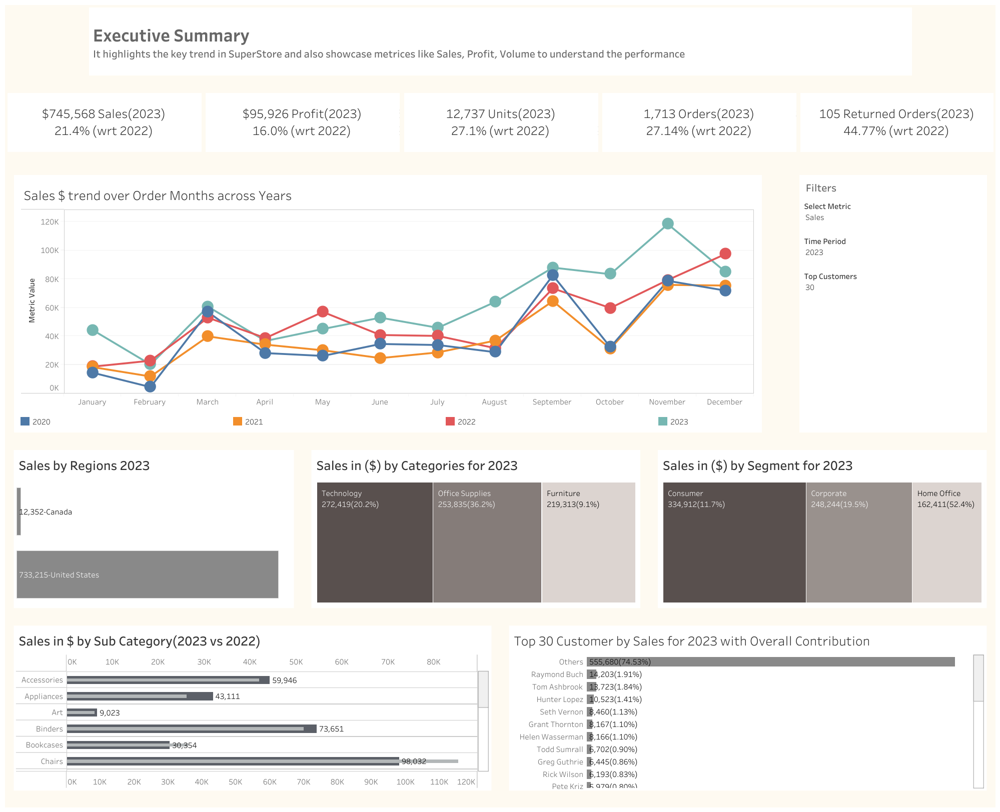

## Dashboard Preview

# Superstore Executive Summary Dashboard | Tableau

## Overview

This repository contains an **Executive Summary Dashboard** built in **Tableau** using the Global Superstore dataset. The dashboard provides an interactive overview of business performance by visualizing key sales metrics, trends, customer insights, and category-wise analysis.

The goal of this dashboard is to help business users quickly monitor sales performance, identify growth opportunities, and make data-driven decisions.

---

## Dashboard Features

### Executive KPIs
- Total Sales
- Total Profit
- Total Units Sold
- Total Orders
- Returned Orders
- Year-over-Year (YoY) Growth Comparison

### Sales Trend Analysis
- Monthly sales trend across multiple years (2020–2023)
- Compare yearly performance over time
- Identify seasonal sales patterns

### Regional Analysis
- Sales comparison by region
- Regional contribution to total revenue

### Category Performance
- Sales distribution by product category
- Technology, Office Supplies, and Furniture comparison

### Customer Segment Analysis
- Sales contribution by customer segment
- Consumer
- Corporate

### Sub-Category Analysis
- Compare sales by product sub-category
- Analyze performance against previous year

### Top Customers
- Top 30 customers ranked by sales
- Overall contribution percentage of each customer

### Interactive Filters
- Select Metric
- Time Period
- Top N Customers

---

## Tools Used

- **Tableau Public**
- Global Superstore Dataset
- Data Visualization
- Dashboard Design

